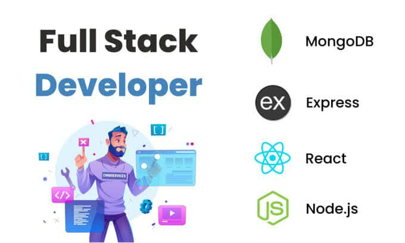

  

<h1 align="center">Hi 👋, I'm Jony</h1>
<h3 align="center">Building scalable web apps with React, Node.js, MongoDB & PostgreSQL</h3>

 
   

- 🔭 I’m currently working on [**Health Care**](https://github.com/Rdm-jony/health_care_frontend)
- 🌱 I’m currently learning **LangGraph**
- 👨‍💻 All of my projects are available at [https://portfolio-c81f1.web.app/](https://portfolio-c81f1.web.app/)
- 📫 How to reach me: **jonydascse@gmail.com**

---

## About Me
Hi, I'm **Jony Das**, a passionate full-stack developer with a strong focus on building **scalable, efficient, and user-friendly web applications**.  
I graduated with a degree in **B.Sc. in Computer Science** and enjoy working across the full technology stack, from designing backend APIs to creating intuitive frontend experiences.  
I love learning new technologies and constantly improving my skills in modern web development.

- 💻 **Skills:** React, Node.js, MongoDB, PostgreSQL, Express.js, JavaScript, TypeScript, Redux, TailwindCSS, HTML, CSS, Bootstrap, Redis, Postman, Figma
- 💡 **Strengths:** Problem-solving, writing clean and maintainable code, and designing robust system architectures.
- 🎯 **Goal:** To contribute to impactful projects and continuously grow as a professional developer.

---

## Connect with Me

  
  

---

## Languages and Tools

 
   
   
   
   
   
   
   
   
   
   
   
   
   
   
   

## 📊 GitHub Stats

  
  

